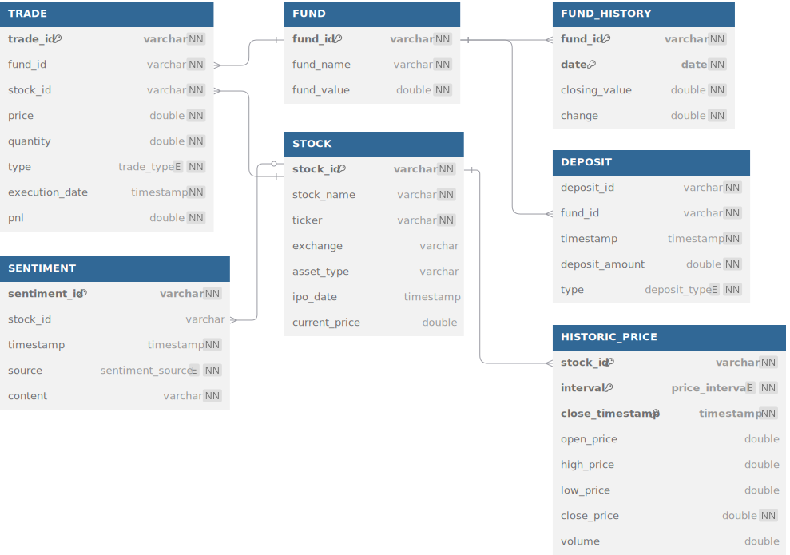

# sentiment_trader

This repository contains the code and documentation for my market sentiment trading project. This project aims to create a data streaming pipeline that collects, processes and analyses market sentiment and price data. All strategies will be backtested using historical data. Finally, I shall connect the strategies to a spread betting API to trade live, should the strategies prove profitable.

I will also create a web application to visualise the data, strategies and market signals, along with writing up a research paper on the findings.

Please use this README as a guide to the project structure and a roadmap for recreating the project.

## Phase 1: Data Engineering and Collection

This phase involves setting up a data pipeline to collect and process market data, sentiment data, and trade data. I will use a MySQL database to store the data and Python for data processing.

### Relational Diagram

### Steps:

1. Execute DDL statements.
2. Execute stock_table_insert.py to populate the stock table.